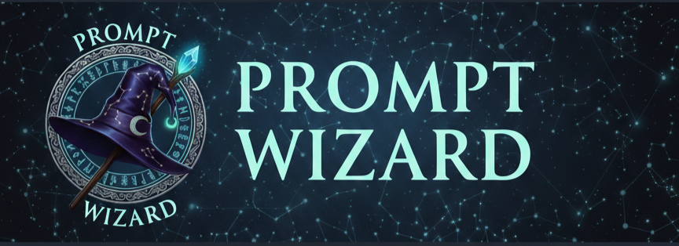

<p align="center">
  
</p>

<h1 align="center">🪄 Prompt Wizard</h1>

<p align="center">
  <strong>AI-Powered Prompt Enhancement for ChatGPT, Claude, Gemini & More</strong>
</p>

<p align="center">
  <a href="https://prompt-wizard-seven.vercel.app">
    
  </a>
  <a href="https://github.com/Justme017/Prompt-Wizard/releases/latest">
    
  </a>
  <a href="https://github.com/Justme017/Prompt-Wizard/blob/main/LICENSE">
    
  </a>
</p>

<p align="center">
  
  
  
  
  
</p>

<p align="center">
  Transform simple prompts into powerful AI instructions. Available as a <strong>Browser Extension</strong> and <strong>Web App</strong>.
</p>

<p align="center">
  <a href="#-browser-extension">Extension</a> •
  <a href="#-web-app">Web App</a> •
  <a href="#-features">Features</a> •
  <a href="#-api-support">API Support</a> •
  <a href="#-contributing">Contributing</a>
</p>

---

## 🎯 What is Prompt Wizard?

Prompt Wizard enhances your AI prompts with structured formatting, context, and requirements - making your AI interactions more effective and productive. Like Grammarly, but for AI prompts!

### Two Ways to Use:

1. **🔌 Browser Extension** - Enhance prompts directly on ChatGPT, Claude, Gemini (Recommended)
2. **🌐 Web Application** - Standalone tool for prompt generation and management

---

## 🔌 Browser Extension

### ✨ Features

- **Auto-Detect**: Floating enhancement button appears on AI chat platforms
- **Multiple Triggers**: 
  - ✨ Click the floating button
  - 🖱️ Right-click → "Enhance Prompt"
  - ⌨️ Keyboard shortcut: `Ctrl+Shift+E` (Windows/Linux) or `Cmd+Shift+E` (Mac)
- **Works Everywhere**: ChatGPT, Claude.ai, Google Gemini, Microsoft Copilot, and ALL websites
- **Instant Enhancement**: Rule-based mode works offline, no API needed
- **AI-Powered** (Optional): Supports OpenRouter & Google Gemini APIs
- **No Login Required**: Works immediately after installation
- **Privacy-First**: All processing happens locally, no data collection

### 📦 Installation

#### Option 1: Download from Releases (Easiest)

1. **Download the Extension**
   - Go to [**Releases Page**](https://github.com/Justme017/Prompt-Wizard/releases/latest)
   - Download `prompt-wizard-extension-v3.2.0.zip`
   - Extract the ZIP file to a folder on your computer

2. **Install in Your Browser**
   
   **For Chrome / Brave / Edge / Opera:**
   ```
   1. Open chrome://extensions (or brave://extensions, edge://extensions)
   2. Enable "Developer mode" (toggle in top-right corner)
   3. Click "Load unpacked" button
   4. Select the extracted 'extension' folder
   5. Done! The extension icon should appear in your toolbar 🎉
   ```

   **For Firefox:**
   ```
   1. Open about:debugging#/runtime/this-firefox
   2. Click "Load Temporary Add-on"
   3. Navigate to the extension folder and select manifest.json
   4. Note: Temporary add-ons are removed when Firefox closes
   ```

#### Option 2: Build from Source

```bash
# Clone the repository
git clone https://github.com/Justme017/Prompt-Wizard.git
cd Prompt-Wizard

# The extension is already built in the 'extension' folder
# Just load it as an unpacked extension (see Option 1, Step 2)
```

### 🚀 How to Use the Extension

1. **Visit any AI chat platform** (ChatGPT, Claude, Gemini, etc.)
2. **Type your prompt** in the text box
3. **Enhancement Options:**
   - Wait for the ✨ floating button to appear → Click it
   - Or select your text → Right-click → "Enhance Prompt"
   - Or select your text → Press `Ctrl+Shift+E`
4. **Review** the enhanced prompt in the modal
5. **Copy or Apply** the enhancement to your input

### ⚙️ Extension Settings

Click the extension icon in your toolbar to:
- Toggle auto-detection on/off
- Select AI provider (None, OpenRouter, Gemini)
- Add API keys for AI-powered enhancement
- Choose your preferred AI model
- View usage statistics

### 🔑 API Setup (Optional)

For AI-powered enhancement:

**OpenRouter:**
1. Get free API key: [openrouter.ai/keys](https://openrouter.ai/keys)
2. Open extension settings
3. Select "OpenRouter" provider
4. Paste your key (format: `sk-or-...`)
5. Choose model (Gemma 3 12B is free!)

**Google Gemini:**
1. Get free API key: [aistudio.google.com/app/apikey](https://aistudio.google.com/app/apikey)
2. Open extension settings
3. Select "Gemini" provider
4. Paste your key (format: `AIza...`)
5. Choose model (1.5 Flash is fast & free!)

---

## 🌐 Web App

**Live Demo:** [https://prompt-wizard-seven.vercel.app](https://prompt-wizard-seven.vercel.app)

### ✨ Features

- **Hybrid Generation Modes**: Rule-based (free) or AI-powered
- **Multiple AI Models**: GPT-4o, Claude 3.5 Sonnet, Gemini Pro, and more
- **Smart Intent Analysis**: Automatically detects prompt type
- **Output Formats**: Plain Text, JSON, Markdown, Code
- **Dark Mode**: Beautiful light/dark theme support
- **Prompt History**: Save and manage your enhanced prompts
- **Templates**: Pre-built prompts for common tasks
- **Export/Import**: Backup your prompt library
- **Token Counting**: Real-time token usage estimates
- **Responsive Design**: Works on all devices

### 💻 Local Development

```bash
# Clone the repository
git clone https://github.com/Justme017/Prompt-Wizard.git
cd Prompt-Wizard

# Install dependencies
npm install

# Start development server
npm run dev

# Open http://localhost:5173
```

### 🏗️ Build for Production

```bash
npm run build
```

### 🚀 Deploy Your Own

[](https://vercel.com/new/clone?repository-url=https://github.com/Justme017/Prompt-Wizard)

Or manually:
```bash
npm run build
npx vercel --prod
```

---

## 🎨 Features

### 🎯 Smart Intent Detection

Automatically analyzes your prompt to determine the best enhancement:

| Intent | Description | Examples |
|--------|-------------|----------|
| 🎨 **Creative Writing** | Stories, articles, content | "Write a sci-fi story about AI" |
| 💻 **Coding** | Scripts, algorithms, debugging | "Create a Python web scraper" |
| 📊 **Analytical** | Research, evaluation | "Analyze market trends in AI" |
| 📈 **Data Science** | Visualization, analysis | "Create a sales dashboard" |
| ✉️ **Communication** | Emails, messages | "Write a professional email" |
| 👨‍🏫 **Educational** | Tutorials, explanations | "Explain quantum computing" |
| 🔍 **Research** | Investigation, findings | "Research renewable energy" |
| 🌐 **General** | Everything else | "Plan a trip to Japan" |

### ⚙️ Output Formats

- 📝 **Plain Text**: Simple, readable format
- 🔗 **JSON**: Structured data format
- 📄 **Markdown**: Formatted documentation
- 💻 **Code**: Programming-specific format

### 🎁 Quick-Start Skills (Web App)

Pre-configured prompts for instant use:
- 🎨 Image Generation (DALL-E, Midjourney)
- 🎵 Audio Generation
- 🎬 Video Generation
- ✉️ Email Writing
- 🔍 Research Assistant
- 👶 ELI5 Explanations
- 📊 Data Analysis
- 💻 Code Review
- 🌐 Translation
- ✍️ Creative Writing
- 📚 Tutoring
- 📝 Summarization

---

## 🔌 API Support

### Supported Providers

| Provider | Models | Free Tier | Get Key |
|----------|--------|-----------|---------|
| **OpenRouter** | 200+ models including GPT-4, Claude, Llama | ✅ Yes (Gemma, Mixtral) | [openrouter.ai/keys](https://openrouter.ai/keys) |
| **Google Gemini** | Gemini 1.5 Flash, Pro, 2.0 | ✅ Yes (15 RPM) | [aistudio.google.com](https://aistudio.google.com/app/apikey) |

### Using APIs

**Extension:**
1. Click extension icon
2. Select AI Provider
3. Enter API key
4. Choose model
5. Start enhancing!

**Web App:**
1. Toggle "Use AI-Powered Mode"
2. Enter API key
3. Select model
4. Generate enhanced prompts

---

## 🛠️ Tech Stack

### Browser Extension
- **Manifest V3**: Modern Chrome extension architecture
- **Vanilla JavaScript**: Lightweight, no framework overhead
- **Chrome Storage API**: Settings persistence
- **Context Menus**: Right-click integration
- **Keyboard Commands**: Shortcut support

### Web Application
- **Frontend**: React 18 with TypeScript
- **Build Tool**: Vite 5
- **Styling**: Tailwind CSS 3
- **Icons**: Lucide React
- **Deployment**: Vercel
- **State Management**: React Hooks

---

## 📁 Project Structure

```
Prompt-Wizard/
├── extension/              # 🔌 Browser Extension
│   ├── manifest.json      # Extension configuration
│   ├── background.js      # Service worker
│   ├── content.js         # Main enhancement logic
│   ├── content.css        # Extension styles
│   ├── popup.html         # Settings UI
│   ├── popup.js           # Settings logic
│   └── icons/             # Extension icons
│
├── src/                   # 🌐 Web Application
│   ├── components/        # React components
│   │   ├── PromptWizardV2.tsx
│   │   ├── PromptEnhancer.tsx
│   │   └── ui/           # UI components
│   ├── pages/            # Page components
│   ├── hooks/            # Custom hooks
│   └── lib/              # Utilities
│
├── public/               # Static assets
└── docs/                 # Documentation
```

---

## 📈 Roadmap

- [ ] Chrome Web Store publication
- [ ] Firefox Add-ons publication
- [ ] GPT Store integration
- [ ] Claude Code integration
- [ ] More AI provider support
- [ ] Prompt templates marketplace
- [ ] Collaborative prompt editing
- [ ] Advanced analytics dashboard

---

## 🤝 Contributing

Contributions are welcome! Please feel free to submit a Pull Request.

### How to Contribute

1. 🍴 Fork the repository
2. 🌿 Create a feature branch (`git checkout -b feature/AmazingFeature`)
3. ✍️ Commit your changes (`git commit -m 'Add some AmazingFeature'`)
4. 📤 Push to the branch (`git push origin feature/AmazingFeature`)
5. 🎉 Open a Pull Request

### Development Guidelines

- Follow the existing code style
- Write clear commit messages
- Update documentation as needed
- Test your changes thoroughly
- For extension changes, test on multiple browsers

---

## 📄 License

This project is licensed under the **Creative Commons Attribution-ShareAlike 4.0 International License**.

[](https://creativecommons.org/licenses/by-sa/4.0/)

You are free to:
- ✅ Share — copy and redistribute the material
- ✅ Adapt — remix, transform, and build upon the material

Under the following terms:
- 📝 Attribution — Give appropriate credit
- 🔄 ShareAlike — Distribute under the same license

---

## 🙏 Acknowledgments

Special thanks to:

- 🎨 [Tailwind CSS](https://tailwindcss.com/) - Utility-first CSS framework
- ⚡ [Vite](https://vitejs.dev/) - Next generation frontend tooling
- ⚛️ [React](https://react.dev/) - JavaScript library for building user interfaces
- 🚀 [Vercel](https://vercel.com/) - Deployment and hosting
- 🎭 [Lucide](https://lucide.dev/) - Beautiful icons
- 🤖 [OpenRouter](https://openrouter.ai/) - Unified API for AI models
- 🧠 [Google AI](https://ai.google.dev/) - Gemini API access

---

## 👨‍💻 Author

<p align="center">
  
</p>

**Shubham Mehta**

[](https://github.com/Justme017)

---

## 📊 Stats


---

<p align="center">
  <strong>⭐ If you find this project useful, please consider giving it a star! ⭐</strong>
</p>

<p align="center">
  Made with ❤️ by <a href="https://github.com/Justme017">Shubham Mehta</a>
</p>
